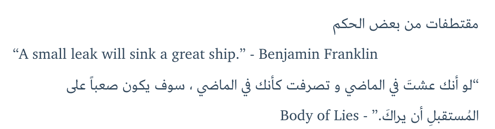

# hexo-tag-ltr

Force LTR layout direction when used in a mixed RTL and LTR texts

# About
> This is a [Hexo](http://hexo.io/) tag plugin for changing the direction of your writing (layout)

## Installation
```bash
npm install --save hexo-tag-ltr
```

## Usage

```bash

  LTR text
 
```

`css class` defaults to `div`

## Example

this is a Arabic document, but wants to have and LTR direction
```


 What I cannot create, I do not understand.


```

and 

```
مقتطفات من بعض الحكم


“A small leak will sink a great ship.” - Benjamin Franklin


"لو أنك عشتَ في الماضي و تصرفت كأنك في الماضي ، سوف يكون صعباً على المُستقبلِ أن يراكَ." - Body of Lies
```

which results in



## Authors

[blueMix](http://bluemix.me)